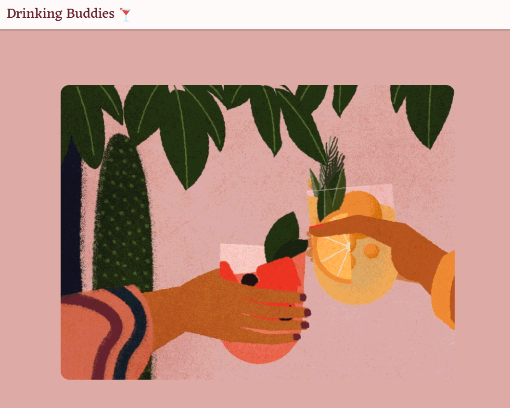
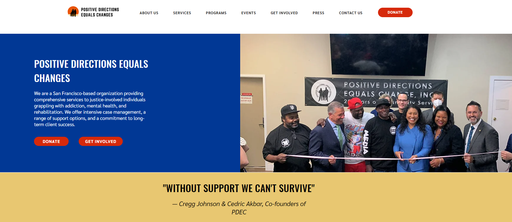
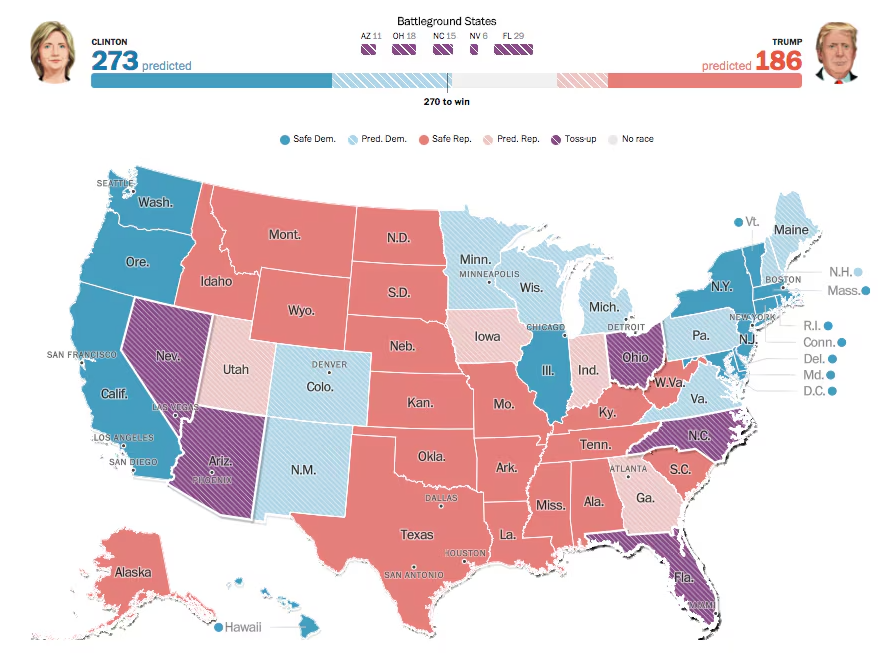
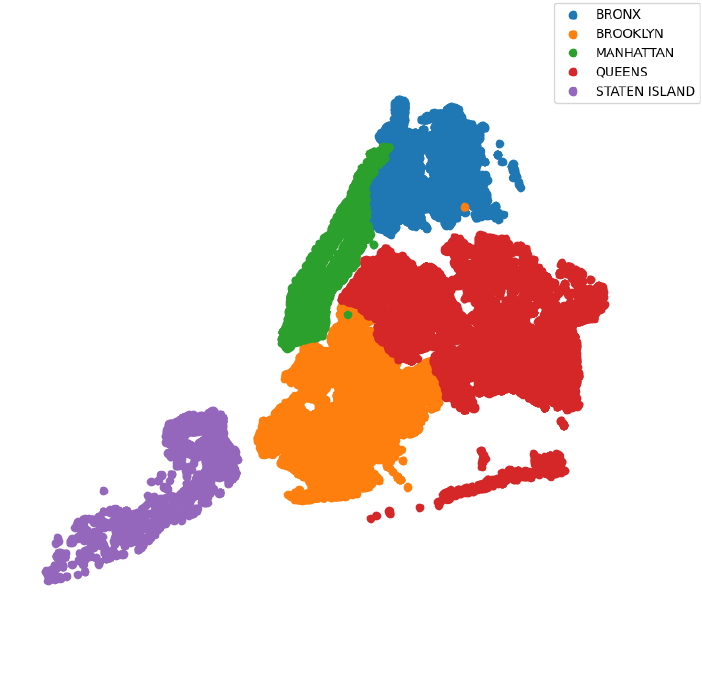

# Projects

    

        
    

    

        <h3 class="project-title">
            <a href="https://rufaida99-k.github.io/DrinkingBuddies-Proj/#/quiz" class="project-link">
                Drinking Buddies
            </a>
        </h3>
        

            A drink recommender website for novice drinkers. I pitched this idea and led a team of peers on a 4-month journey to build it.
        

        

            <a href="https://github.com/rufaida99-k/DrinkingBuddies-Proj" class="tag tag-github">GITHUB</a>
            Full Stack
        

    

    

        
    

    

        <h3 class="project-title">
            <a href="https://www.positivedirectionsequalschange.org/" class="project-link">
                Develop For Good: Positive Directions Equals Changes (PDEC)
            </a>
        </h3>
        

            As Product Manager, I led a team of 6 designers over 4 months to build a user-friendly website for PDEC, a non-profit assisting justice-involved individuals.
        

        

            <a href="https://drive.google.com/file/d/1WRF-hG8AMLKgFqaE4Qgc_YPrSYonG7IS/view?usp=sharing" class="tag tag-arxiv">CASE STUDY</a>
            Product Management
            UI/UX
        

    

    

        
    

    

        <h3 class="project-title">
            <a href="https://www.notion.so/Analyzing-Predictive-Accuracy-of-Polls-in-the-2016-U-S-Presidential-Election-5d99f8b541d84e30b550faa5fb5fc9fd" class="project-link">
                Predictive Accuracy of Polls: Presidential Election '16
            </a>
        </h3>
        

            Surprised by the 2016 election, I conducted an in-depth data analysis to compare polls with actual results, uncovering insights on their predictive reliability.
        

        

            <a href="https://www.notion.so/Analyzing-Predictive-Accuracy-of-Polls-in-the-2016-U-S-Presidential-Election-5d99f8b541d84e30b550faa5fb5fc9fd" class="tag tag-github">NOTION</a>
            Data Analysis
            R
        

    

    

        
    

    

        <h3 class="project-title">
            
        </h3>
        

            Curious about which borough was safest, I analyzed NYC's Open Data on vehicular accidents. After cleaning and organizing, I found Brooklyn had the highest % of accidents.
        

        

            
            Data Analysis
            Data Cleaning
        

    

